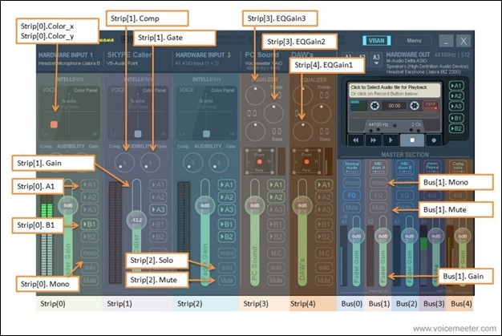

# Volume Control Voicemeeter C#

This project is based on deej and the Voicemeeter API.
It enables you to control Voicemeeter with analog Arduino Input

## Installation

1.Use the Arduino IDE to upload this code to the Arduino. 

```C
const int NUM_SLIDERS = 11; //Edit based on the sliders you have.
const int analogInputs[NUM_SLIDERS] = {A0, A1, A2, A3, A4, A5, A6, A7, A8, A9, A10}; //Edit based on the sliders you have.

int analogSliderValues[NUM_SLIDERS];

void setup() { 
  for (int i = 0; i < NUM_SLIDERS; i++) {
    pinMode(analogInputs[i], INPUT);
  }

  Serial.begin(9600);
}

void loop() {
  updateSliderValues();
  sendSliderValues(); // Actually send data (all the time)
  // printSliderValues(); // For debug
  delay(10);
}

void updateSliderValues() {
  for (int i = 0; i < NUM_SLIDERS; i++) {
    float AverageTemperature = 0;
    int MeasurementsToAverage = 16;
    for(int r = 0; r < MeasurementsToAverage; ++r)
    {
      AverageTemperature += analogRead(analogInputs[i]);
      delay(1);
    }
    AverageTemperature /= MeasurementsToAverage;
    analogSliderValues[i] = AverageTemperature;
  }
}

void sendSliderValues() {
  String builtString = String("");

  for (int i = 0; i < NUM_SLIDERS; i++) {
    builtString += String((int)analogSliderValues[i]);

    if (i < NUM_SLIDERS - 1) {
      builtString += String("|");
    }
  }
  
  Serial.println(builtString);
}

void printSliderValues() {
  for (int i = 0; i < NUM_SLIDERS; i++) {
    String printedString = String("Slider #") + String(i + 1) + String(": ") + String(analogSliderValues[i]) + String(" mV");
    Serial.write(printedString.c_str());

    if (i < NUM_SLIDERS - 1) {
      Serial.write(" | ");
    } else {
      Serial.write("\n");
    }
  }
}
```
2. Download Autohotkey and run this script or use the pre compiled Version.
```ahk
#NoEnv  ; Recommended for performance and compatibility with future AutoHotkey releases.
; #Warn  ; Enable warnings to assist with detecting common errors.
SendMode Input  ; Recommended for new scripts due to its superior speed and reliability.
SetWorkingDir %A_ScriptDir%  ; Ensures a consistent starting directory.
Run, VoicemeeterSliderControl.exe , , Hide


#z::
Process, Close, VoicemeeterSliderControl.exe

#u::
Run, VoicemeeterSliderControl.exe , , Hide
```

3. Put the AHK script in the same folder as the VoicemeeterSliderControl.exe file.
4. Edit the Config.json to fit your needs!
```json
{
    "PortName":"COM3",
    "BaudRate":9600,
    "SliderSets":[
    {
        "Slider":0,
        "VoicemeeterValue":"Bus[0].Gain"
    },
    {
        "Slider":1,
        "VoicemeeterValue":"Bus[1].Gain"
    },
    {
        "Slider":2,
        "VoicemeeterValue":"Bus[2].Gain"
    },
    {
        "Slider":3,
        "VoicemeeterValue":"Strip[5].Gain"
    },
    {
        "Slider":4,
        "VoicemeeterValue":"Strip[6].Gain"
    },
    {
        "Slider":5,
        "VoicemeeterValue":"Strip[7].Gain"
    }
    ]
}
```


5. Run it! When you run it, it starts automatically! (With Win+z and Win+u you can start or stop it.)
### Contributing
Pull requests are welcome. For major changes, please open an issue first to discuss what you would like to change.

Please make sure to update tests as appropriate.

## License
[MIT](https://choosealicense.com/licenses/mit/)
